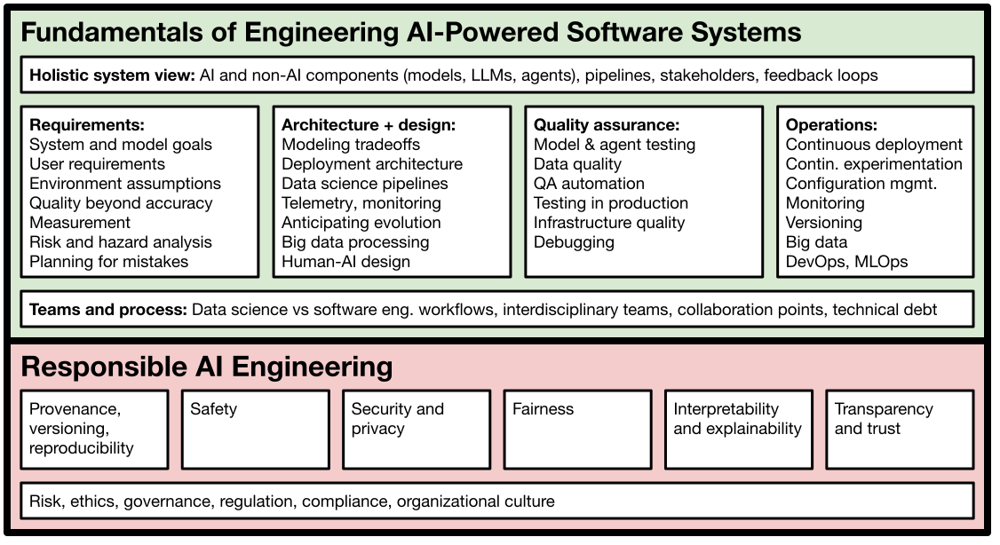

# Machine Learning in Production (17-445/17-645/17-745)

### Fall 2026

Plenty of courses teach you to beat a benchmark in a notebook, and plenty more teach you to pitch a demo, hackathon style. But a demo has no real customer, no real deployment, and no real stakes: Nobody depends on it, nothing breaks when it fails, nobody needs to maintain it. This CMU course is about the hard part that comes next: turning that prototype into a real **AI-powered software system** that provides benefits to actual customers, that you deploy in the real world, and that keeps running, keeps getting updated, and *doesn't go up in flames* with security holes, safety incidents, or silent quality collapse. 

You will learn **AI engineering** end to end, working across classic ML, LLMs, and increasingly **AI agents that take actions in the real world**: how to build the system around the model, ship it, know whether it actually works, anticipate the ways it will fail, and keep it operating and improving under real load. Because models make mistakes, and agents act on those mistakes, **managing risk** runs through the entire course, alongside **MLOps** and **responsible AI** (safety, security, explainability, fairness). 

For earlier offerings see the [overview page](https://mlip-cmu.github.io). This Fall 2026 offering is designed for students with some data science and GenAI experience (e.g., has taken a machine learning course, has used sklearn and LLMs) and basic programming skills (e.g., basic Python programming with libraries, can navigate a Unix shell), but will not expect a software engineering background (i.e., experience with testing, requirements, architecture, process, or teams is not required). Going forward we expect to offer this course regularly both in the spring and in the fall semester.

## Who This Course Is For

This is a course for those who want to **build and operate AI-powered software systems**, going beyond benchmarks and one-off demos. A demo you present and walk away from is easy; it is not a product. We assume that you can already train a model, write prompts, or work with agents to build a demo. We start from there, exploring what it takes to turn that model into something a real customer depends on: to actually deploy it, know whether it works well enough, keep it from failing in embarrassing or dangerous ways, and successfully operate and improve it at scale, for weeks and months, as data and the world shift around it. Shipping something that survives contact with real users is what distinguishes an engineer teams can rely on, and startups and big tech alike are desperately hiring for it.

The course is a strong fit for students heading toward roles like **AI Engineer, ML Engineer, MLOps Engineer, AI Product Manager, Forward Deployed Engineer,** or **Applied Scientist**, including software engineers who want to move from building conventional systems to building AI-powered ones.
Building AI-powered systems is a team effort across **software engineers**, **data scientists**, and **product managers**. Each brings different expertise and priorities, and they succeed only with a shared understanding of one another's roles, concerns, and goals. The course speaks to all three: **software engineers** who want to build robust, responsible products despite the specific challenges of ML models, LLMs, and agents; **data scientists** who want to understand production requirements and get their prototype models shipped; and **product managers** who want to grasp the technical realities of what it takes to ship a deployable product.

## What we cover

We cover topics such as:

* **How to design for wrong predictions the model may make?** How to assure *safety* and *security* despite possible mistakes? How to anticipate mistakes before they occur and how to manage risks? How to design the *user interface* and the entire system to mitigate mistakes when operating in the real world? How can modern architectures like RAG and agentic systems help or hinder such efforts?
* **How to build and operate AI agents responsibly?** As systems increasingly *take actions* through tools and APIs (e.g., via protocols like MCP or agent skill files), how do we design, evaluate, and *secure* agentic systems, and contain the new risks that arise once an AI can take actions with real consequences in the world?
* **How to reliably deploy, monitor, and update models in production?** How can we *test* the entire machine learning pipeline? How can *MLOps* tools help to automate and scale the deployment process? How can we *experiment in production* (A/B testing, canary releases)? How do we detect *data quality* issues, *concept drift*, and *feedback loops* in production?
* **How to scale production AI systems?** How do we design a system to process huge amounts of training data, telemetry data, and user requests? Should we use stream processing, batch processing, lambda architecture, or data lakes?
* **How to test and debug production AI systems?** How can we *evaluate* the quality of a model/agent in ways that matter for a production system, going well beyond benchmark scores (slicing, rubrics, capabilities, LLM-as-a-judge, ...)? How can we know how well we are doing in production, while safeguarding against disasters? How can we *test* the entire AI system, rather than the model in isolation? What lessons can we learn from *software testing*, *automated test case generation*, *simulation*, and *continuous integration* for testing production AI systems?
* **Which qualities matter beyond a model’s prediction accuracy?** How can we identify and measure important quality requirements, including *learning and inference latency, operating cost, scalability, explainablity, fairness, privacy, robustness*, and *safety*? Does the application need to be able to *operate offline* and how often do we need to update the models? How do we identify what’s important in an AI-powered product in a production setting for a business? How do we resolve *conflicts* and *tradeoffs*?
* **How to work effectively in interdisciplinary teams?** How can we bring data scientists, software engineers, UI designers, product managers, project managers, domain experts, big data specialists, operators, legal council, and other roles together and develop a *shared understanding* and *team culture*?

**Production-ready tools.** You will gain familiarity with production-quality infrastructure tools, including stream processing with Apache Kafka, test automation with GitHub actions, monitoring and experiment tracking with Prometheus, Grafana, DVC, and Weights and Biases, and deployment with Docker, Kubernetis and various MLOps tools. Familiarity with these has helped many past students through technical interviews.

**Examples, case studies, projects.** We explore real products with commercial potential, going beyond benchmark tasks. For example, instead of object detection in the abstract, we look at how to use it in delivery robots or for image search on a photo sharing site. Some of these products may be less flashy, but have real commercial potential today, such as customer support agents, insurance fraud investigation, content recommendation, creating meeting minutes from recordings, and diagnosing diseases.

An extended group project takes you through building, deploying, evaluating, and maintaining a robust and scalable *movie recommendation service* under realistic “production” conditions serving 1 million active users. This is not a toy: your system runs live for several weeks, is graded on how it holds up under real load and changing environment conditions. You and your team will feel firsthand what breaks when a model meets production, and how to fix it.

## Fall 2026: Logistics and People

17-445/17-645/17-745, 12 Units

Lectures Tuesday/Thursday 3:30-4:50pm, in person, DH 2315

Labs Friday 9:30-10:50am in DH 1211 (B) and 11-12:20pm in DH 2302 (C) and 12:30-1:50pm in PH 125C (D) and 2-3:20pm in DH 1112 (E) and 3:30-4:50pm in PH A18A (F). 

Instructors: [Bogdan Vasilescu](https://bvasiles.github.io) and [Christian Kaestner](https://www.cs.cmu.edu/~ckaestne/).

TAs: Vedika Agarwal, Yubo Chen, Ashritha Gonuguntla, Anshuman Mishra, Juan Ortega, Shreya Verma

The course is the same under all course numbers, except for the PhD-level 17-745 number, which replaces two homework assignments with a mandatory [research project](https://github.com/mlip-cmu/f2026/blob/main/assignments/research_project.md).

Open to all undergraduate and graduate students meeting the prerequisites. Remote sections are only available to students at the CMU-Africa campus after discussing parameters with the instructors.

## Schedule

[Schedule]

(We may adjust covered content per lecture throughout the semester.)

## Resources

For researchers, educators, or others interested in this topic, we share all course material, including slides and assignments, under a creative commons license on GitHub (https://github.com/mlip-cmu).
* Slides, labs, and assignments linked in the schedule of each semester
* [Video recordings](https://www.youtube.com/playlist?list=PLDS2JMJnJzdmubSKnanmIwzr08cionWm_) of the lectures from the Spring 2026 semester.
* [Textbook](https://mlip-cmu.github.io/book/) with chapters corresponding to almost every lecture.
* An article describing the rationale and the initial design of this course: [Teaching Software Engineering for AI-Enabled Systems](https://arxiv.org/abs/2001.06691).
* An [annotated bibliography](https://github.com/ckaestne/seaibib) on research in this field.

We would be happy to see this course or a similar version taught at other universities -- reach out if interested.

## Course Syllabus and Policies

The course uses Canvas for homework submission, grading, and supplementary documents; slides will be posted here; Slack is used for announcements and discussions; GitHub is used to coordinate group work. All public course materials can be found in the course’s [GitHub repository](https://github.com/mlip-cmu/f2026).

**Communication:** We are happy to answer questions over Slack (preferred) and by email, meet in person, and will jump on a quick Zoom call if you ask us. We strongly recommend to turn on notifications for Slack at least for direct messages and the announcements channel throughout the semester. We also always arrive 5 to 10 min early to class and stay longer for discussions and questions. If you have questions about assignments and logistics, we prefer that you ask them publicly on Slack.

**Prerequisites:** The course does not have formal prerequisites, but we describe background knowledge that will help you be successful in the course. In a nutshell, we expect basic exposure to machine learning and basic programming skills, but do not require software engineering experience. 

*Machine learning (some experience recommended):* We suggest that you have basic familiarity with the process of extracting features, building and evaluating models, prompting LLMs, and a basic understanding of how and when different kinds of learning techniques work. Familiarity with Python and Jupyter notebooks is helpful. Courses such as 10-301, 10-315, and 05-434 will prepare you well, but project experience or self-learning from books or online courses will likely be sufficient for our purposes. For example, if you have no prior experience, we recommend the book [Hands-On Machine Learning](https://cmu.primo.exlibrisgroup.com/permalink/01CMU_INST/6lpsnm/alma991019665684604436) to get practical experience in training and evaluating models prior to taking this course. We have set up a *[prerequisite knowledge check](https://forms.gle/JcS61Uao7wHSFQen8)* as a Google Form, where we ask 10 questions on machine learning, which help you assess your background – this is set up as an anonymous and ungraded quiz, where you can compare your knowledge against what we believe is useful for you to be successful in this course (click on *“view score”* after submitting your answer). After submitting your answers, the system will give specific pointers to readings and exercises that may help you fill gaps in background knowledge. 

*Programming (basic proficiency required):* The course has a substantial programming component in all individual assignments and in the team project, so basic programming skills will be needed. Familiarity with *LLMs/coding agents* will be very useful, but if you take the course without programming experience or solely rely on LLMs/agents for all your coding, you will significantly struggle and will likely cause conflicts within the group project. We expect that you meet the following criteria: (1) basic fluency in a programming language like Python, (2) ability to install and learn libraries in that language, (3) ability to ssh into a Unix machine and perform basic command line operations, and (4) ability to install and learn new developer tools like Docker. We do not prescribe a programming language, but almost all student teams decide to work primarily in Python. We will provide some introductions and examples for essential tools like Git, Docker, Grafana, and Kafka in labs, but we expect that you will be able to pick up new tools and libraries on your own. If you are worried whether your technical background is sufficient, we recommend that you look at (or even try) [homework I1](https://github.com/mlip-cmu/f2026/blob/main/assignments/I1_mlproduct.md) before the semester.

*Software engineering (no experience required):* Many students will have some software engineering experience beyond basic programming skills from software engineering courses, from internships, or from working in industry. This may include experience with requirements engineering, software design/architecture, software testing, distributed systems, continuous deployment, or managing teams. No such experience is expected as a prerequisite; we will cover these topics in the course.

Email the instructors if you would like to further talk to us about prerequisites.

**In-person teaching and lecture recordings:** The course will be taught in person, with limited exceptions for students at the CMU-Africa campus. We will record lectures and publicly share the recordings. We do _not_ provide a synchronous remote option, and we do not record labs. 

We consider in-class participation and active participation in labs an important part of the learning experience and encourage it strongly. However, we will give you the choice whether you want your participation to be graded (see below).

We regularly use Slack for in-class activities. Please make sure that you have access to Slack on a laptop, tablet, or mobile phone during class. 

If you are sick, please do not come to class. If you cannot attend class due to a medical issue, family emergency, interview, or other unforeseeable reason, please contact us about possible accommodations. We try to be as flexible as we can, but will handle these cases individually.

**Exams:** The course has two midterms and a final project presentation. The project presentation will happen in the registrar-assigned timeslot of the final exam (to be announced about halfway through the semester [here](https://www.cmu.edu/hub/docs/final-exams.pdf)). The midterms are during the normal class period as per schedule. The second midterm is not comprehensive, and only covers material after the first midterm. Examples of past midterms can be found in the [course repository](https://github.com/mlip-cmu/f2026/tree/main/exams).

**Grading:** Evaluation will be based on the following distribution: 35% individual assignments, 30% group project, 25% midterms and participation (see below), 10% labs. No final exam.

We strive to provide clear specifications and clear point breakdowns for all homework to set clear expectations and take the guessing out of homework. We often give you choices to self-direct your learning, deciding what to work on and how to address a problem (e.g., we never prescribe a programming language). Clear specifications and point breakdowns allow you to intentionally decide to skip parts of assignments with clear upfront consequences. All parts will be graded pass/fail for the points indicated, no partial credit. Some parts of the grading rubric will require you to verbally explain your solution to a member of the course staff or verbally answer their questions -- usually in person during any office hours within one or two weeks of submitting the assignment.  For opportunities to redo work, see *resubmissions* below. Some assignments have a small amount of bonus points. 

Since we give flexibility to resubmit assignments, we set grade boundaries fairly high. We do not round points for grading. You can plan with the following grade boundaries:

| Grade | Cutoff |
| ---- | ---- |
| A+   | ≥99% |
| A    | ≥96% |
| A-   | ≥94% |
| B+   | ≥91% |
| B    | ≥86% |
| B-   | ≥82% |
| C    | ≥75% |
| D    | ≥60% |

**Participation:** Design and engineering content strongly benefits from active engagement with the material and discussions of judgment decisions on specific scenarios and cases. We strongly believe in in-class discussions and in-class exercises and want all students to participate, e.g., answering or asking questions in class, sharing own experiences, presenting results, or participating in in-class votes and surveys. We will give many opportunities for participation in every lecture and lab, including at least one breakout session in every single lecture.

Students in the class can *opt in* to having their participation reflected in the grade. If they do, the midterms count for 15% and participation for 10%. If they do not, midterms count for 25% and participation is not graded.

For participation grading, we note student engagement with in-class activities to include as a component in grading. We also consider inauthentic participation in in-class activities (e.g., asking others to cover for you and pretend you participated) as an academic integrity violation (see below).  Please talk to us if you need accommodations.

For students opting into in-class participation, we assign participation grades as follows:

* 100%: Participates actively at least once in most lectures (4 lectures waived, no questions asked)
* 80%: Participates actively at least once in two thirds of the lectures
* 60%: Participates actively at least once in over half of the lectures
* 30%: Participates actively at least once in one quarter of the lectures
* 0%: Participation in less than one quarter of the lectures.

**Labs:** Labs typically introduce tools and have a task with multiple clear deliverables. Each deliverable is graded pass/fail. You receive a grade by showing your work to the TA during that week's lab session (your own section). Typically showing your work involves showing source code, demoing executions, and verbally answering a few questions to demonstrate your understanding. The TA may ask a few questions to probe your understanding. While labs are generally in person as scheduled by the registrar, we may offer additional opportunities to show your work to a TA *online* the evening before the lab sessions.

Lab assignments are designed to take about 1 to 2 hours of work. We encourage you to start the lab before the lab session, but you can continue to work on it during the lab session. We encourage collaboration on labs: You can work together with other students both before the lab session and during the lab session. While we do not recommend it, you may look at and even copy other solutions. However, you will have to present and explain your solution to the TA on your own.

We intend labs to be low stakes – this is your first practical engagement with the material and mistakes are a normal part of the learning process. Deliverables are graded pass/fail on whether they meet the stated expectations for the deliverables. If your solution does not meet the expectations you can continue working on it during the lab session until it does. For example, the TA may ask you to revisit your solution or look up documentation if not satisfied with your explanation. Outside of explicit accommodations (e.g., medical issues) or using tokens (see below), we do not accept lab solutions after the end of your lab session.

**Textbook, reading assignments, and reading quizzes:** The book "[Machine Learning in Production](https://mlip-cmu.github.io/book/)" aligns closely with the lecture content -- available for free [online](https://mlip-cmu.github.io/book/) and in print through [MIT Press](https://mitpress.mit.edu/9780262049726/machine-learning-in-production/) or anywhere where books are sold. We will not assign chapters from our own textbook, but we always point to the corresponding chapter for each lecture. You might find these useful to review concepts from the lectures.

We will assign various additional readings, including blog posts and academic papers, throughout the semester, typically one per week. We expect that you read the assigned readings before that lecture and that you will be able to discuss them during the lecture or in in-class activities.

**Teamwork:** Teamwork is an essential part of this course. The course contains a multi-milestone group project to be done in teams of 3-6 students. Teams will be assigned by the instructor. A TA will serve as a mentor for each team. We will help teams throughout the semester and cover some specific content on teamwork as part of the course. Peer rating will be performed for team assignments with regard to *team citizenship* (i.e., being active and cooperative members), following a procedure adapted from [this article](https://www.cs.tufts.edu/~nr/cs257/archive/teaching/barbara-oakley/JSCL-collaboration.pdf), which we will further explain in an early lecture. Use [this form](https://mlip-cmu.github.io/f2026/assignments/peergrading.html) to preview the expected grade adjustments for peer ratings. Each team must schedule a 30 minute meeting with their team mentor in the week after every milestone to discuss their solution, debrief on teamwork, and explore possible strategies to improve teamwork. 

**Late work policy and resubmissions:** We understand that students will have competing deadlines, unusual events, interviews for job searches, and other activities that compete with coursework. We therefore build flexibility and a safety net directly into the rubric. If you need additional accommodations for exceptional circumstances, please contact us.

In addition, we expect that the pass/fail grading scheme without partial credit, may lead to harsh point deductions for missing small parts of the requirements, so we provide a mechanism to resubmit work to regain most lost points.

Every student receives *8 individual tokens* that they can spend throughout the semester in the following ways:

* For each token, a student can submit a homework assignment 1 day late without any grading penalty (with 2 tokens a student can submit two homeworks one day late each or a single homework up to two days late). If a student runs out of tokens, late individual assignments receive a penalty of 15% per started day. 
* For *three* tokens, a student can resubmit (i.e., improve or redo) an individual homework assignment. If the grade for the resubmitted assignment is higher than the original grade, 90% of the difference is added to the original grade. For example, if the original assignment was 80 points and the resubmitted one was 100 points, the resulting grade is 80+(100-80)*.9 = 98 points. Resubmissions can be made at any time in the semester up to the final project presentation (see schedule). – Note that this technically allows a student to blow the original deadline (no submission necessary, receiving 0 points initially) and then resubmit the homework arbitrarily late for three tokens and a 10% penalty.
* For one token, a student can complete a lab late or redo a lab (any time before the final presentation) by showing the work to a TA during office hours.
* Penalties for late/missing team formation survey and late/missing teamwork peer assessment surveys can be waived for one token each.
* Remaining individual tokens at the end of the semester are counted as one participation day each.

Every team independently receives *8 team tokens* that they can spend for extensions of any milestone deadline (1 token per day per milestone, except final presentation deadline) or to resubmit any milestone  (3 tokens each, resubmitted any time before the final presentation; same 10% tax on regained points as for individual assignments). If a team runs out of tokens, late submissions in group assignments receive a penalty of 15% per started day.

Individual tokens and team tokens are entirely separate; it is not possible to use individual tokens for teamwork or vice versa. The team should make collective decisions about how to use team tokens.

In general, late submissions and resubmissions can be done at any point in the semester before the final presentations. Submit them in Canvas as a "new attempt". 

Exceptions to this policy will be made at the discretion of the instructor in important circumstances, almost always involving a family or medical emergency and an email from your advisor. You can ask your academic advisor or the Dean of Student Affairs to request the exception on your behalf. Where issues affect teamwork, please communicate proactively with your team.

**Auditing:** Due to the high demand for this course, we do *not* allow official forms of auditing. If you like to self-study, all course materials are online. We welcome interested students and visitors to sit in for lectures as long as the room capacity allows it. 

**Time management:** This is a 12-unit course, and it is our intention to manage it so that you spend close to 12 hours a week on the course, on average. In general, 3 hours/week will be spent in class, about 1-2 hour for the labs, and 7 hours on assignments. Notice that much homework is done in groups, so please account for the overhead and decreased time flexibility that comes with groupwork. Please give the course staff feedback if the time the course is taking for you differs significantly from our intention.

**Use of content generation AI tools and external sources:** Given the nature of this course, we are open to using AI tools for completing work. Except for two restrictions (see below), we place no restrictions on the use of content generation tools, such as ChatGPT, Claude, Claude Code, Co-Pilot, or Cursor. You may also reuse code from external sources, such as StackOverflow or tutorials, without acknowledgment. In any case, you will be solely responsible for the correctness of the solution. Note that content generation tools often create plausible-looking but incorrect answers, which will not receive credit. Using code generation tools without understanding the generated code will likely create challenges when answering TA questions for labs or assignments and will likely create teamwork problems. You are also responsible for complying with any applicable licenses. 

There are two settings where AI use is strictly prohibited: (1) exams and any on-paper quizzes we designate as strictly offline, and (2) live conversations with course staff, whether over Zoom or in person. Using any form of AI to generate answers in these settings is considered cheating.

**Academic honesty and collaboration:** The usual policies apply, especially the [University Policy on Academic Integrity](https://www.cmu.edu/policies/student-and-student-life/academic-integrity.html). Many parts of the work will be done in groups. We expect that group members collaborate with one another, but that groups work independently from other groups, not exchanging results with other groups. Within groups, we expect that you are honest about your contribution to the group's work. **This implies not taking credit for others' work and not covering for team members that have not contributed to the team.** **This also applies to in-class discussions, where indicating working with others who did not participate in the discussion is considered an academic honesty violation.** Otherwise, our expectations regarding academic honesty and collaboration for group and pair work are the same as for individual work, elevated to the level of the "group."

Beyond that, the key guiding principle of academic honesty in this course is: *"You may not copy any part of a solution to a problem that was written by another student (in this or prior iterations of the class), or was developed together with another student, or was delegated to another person. You may not look at another student's solution, even if you have completed your own, nor may you knowingly give your solution to another student or leave your solution where another student can see it.*" Note that this implies that you cannot publicly post your solutions on GitHub (e.g., as part of a portfolio during job applications). While the use of AI content generation tools is okay (see above) using the work from other students is not. Discussing challenges and solution strategies with others at a high level is okay, sharing code or text is not.

You may collaborate with other students on labs, but not on homeworks and exams.

We also expect and respect honesty when communicating with the course staff.

Any violation of this policy is cheating. The minimum penalty for cheating will be a zero grade for the whole assignment. For cheating on participation, the minimum penalty is -100% on the participation grade. Cheating incidents will also be reported through University channels, with possible additional disciplinary action (see the University Policy on Academic Integrity). There is no statute of limitations for violations of the collaboration policy; penalties may be assessed (and referred to the university disciplinary board) after you have completed the course, and some requirements of the collaboration policy (such as restrictions on you posting your solutions) extend beyond your completion of the course.

If you have any question about how this policy applies in a particular situation, ask the instructors for clarification.

**Research in this Course:** We are conducting academic research in this course. This research will involve analyzing student work on assignments. You will not be asked to do anything above and beyond the normal learning activities and assignments that are part of this course. You are free not to participate in this research, and your participation will have no influence on your grade for this course or your academic career at CMU. If you do not wish to participate, please send an email to Nadia Nahar (nadian@andrew.cmu.edu). Participants will not receive any compensation or extra credit. The data collected as part of this research will not include student grades. All analyses of data from participants’ coursework will be conducted after the course is over and final grades are submitted -- instructors will not know who chooses not to participate before final grades are submitted. All data will be analyzed in de-identified form and presented in the aggregate, without any personal identifiers. If you have questions pertaining to your rights as a research participant, or to report concerns to this study, please contact Nadia Nahar (nadian@andrew.cmu.edu) or the Office of Research Integrity and Compliance at Carnegie Mellon University (irb-review@andrew.cmu.edu; phone: 412-268-4721).

**Accommodations for students with disabilities:** If you have a disability with an accommodations letter from the Disability Resources office, we encourage you to discuss your accommodations and needs with us as early in the semester as possible. Please come and talk to us and do not rely on automated emails from the Disability Resources office. We will work with you to ensure that accommodations are provided as appropriate. If you suspect that you may have a disability and would benefit from accommodations but are not yet registered with the Office of Disability Resources, we encourage you to contact them at access@andrew.cmu.edu.

**A note on self care.** Please take care of yourself. Do your best to maintain a healthy lifestyle this semester by eating well, exercising, avoiding drugs and alcohol, getting enough sleep and taking some time to relax. This will help you achieve your goals and cope with stress. All of us benefit from support during times of struggle. You are not alone. There are many helpful resources available on campus and an important part of the college experience is learning how to ask for help. Asking for support sooner rather than later is often helpful.
If you or anyone you know experiences any academic stress, difficult life events, or feelings like anxiety or depression, we strongly encourage you to seek support. Counseling and Psychological Services (CaPS) is here to help: call 412-268-2922 and visit their website at http://www.cmu.edu/counseling/. Consider reaching out to a friend, faculty or family member you trust for help getting connected to the support that can help.
If you are worried about affording food or feeling insecure about food, there are resources on campus that can help, such as the [CMU Pantry](https://www.cmu.edu/student-affairs/resources/cmu-pantry/).

